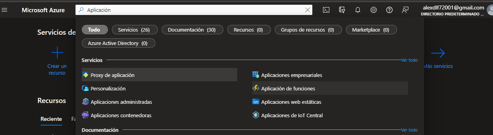
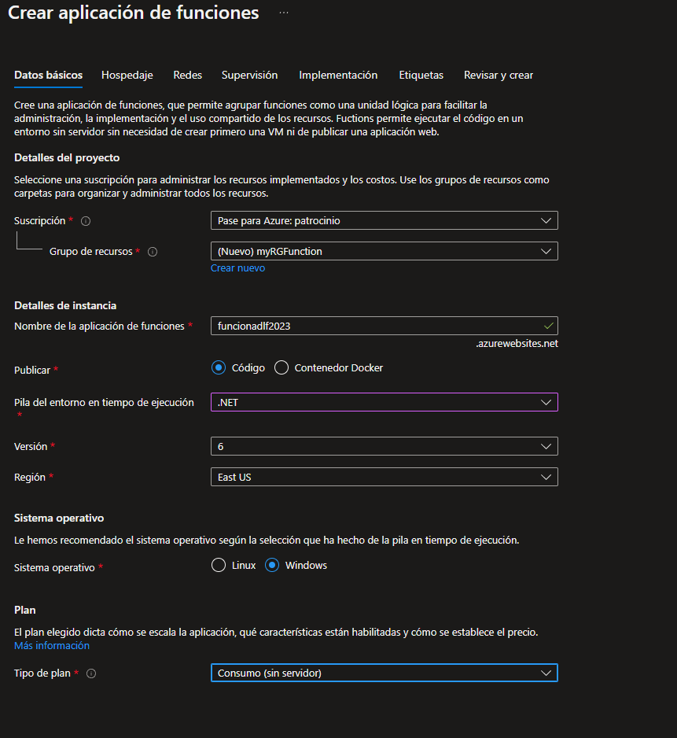
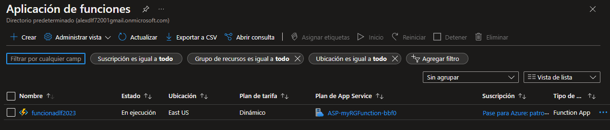
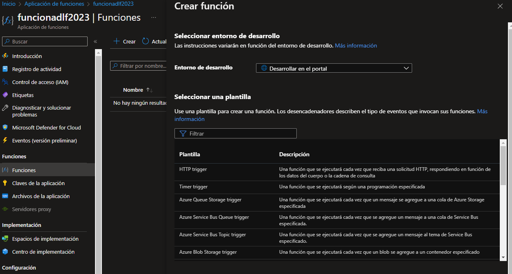
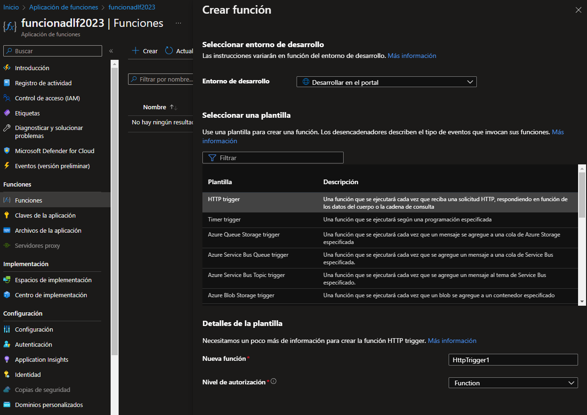
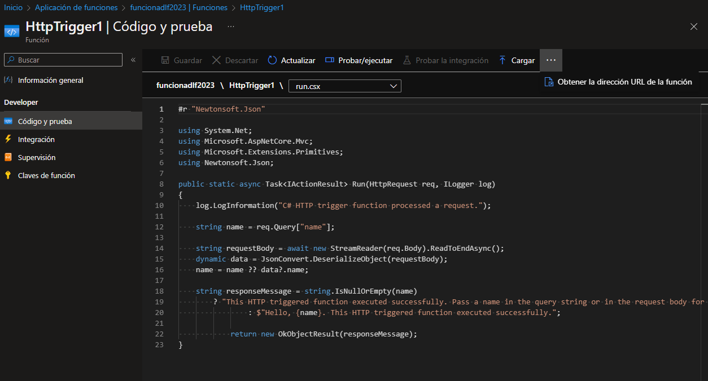
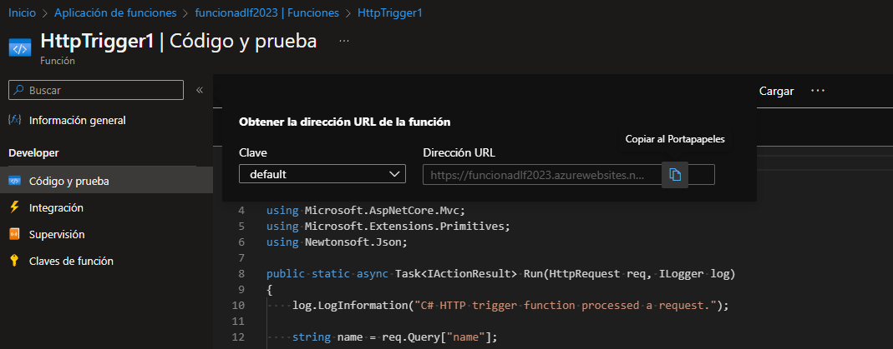
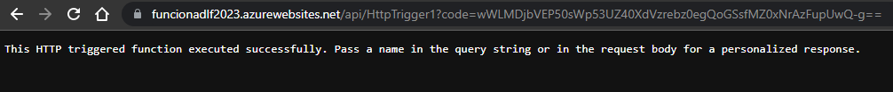
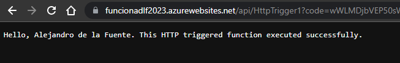
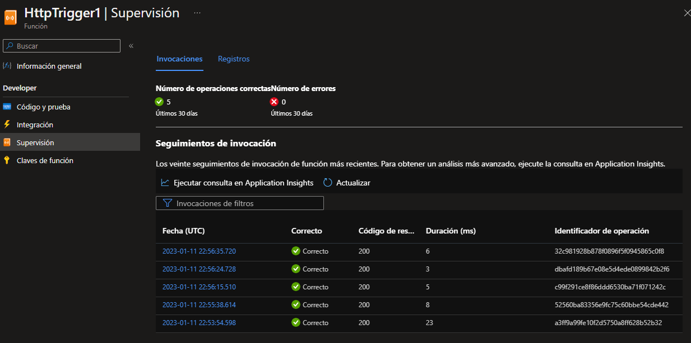

# IMPLEMENTAR AZURE FUNCTIONS

Crearemos una aplicación de funciones para mostrar un saludo cuando haya una solicitud HTTP.

### PASO 1: Crearemos una aplicación Functions

En el cuadro de texto **Buscar recursos, servicios y documentos**, en la parte superior del portal, buscaremos y seleccionaremos **Aplicación de funciones** y luego, desde la hoja **Aplicación de funciones**, haga clic en **Crear**.

En la página **Datos Básicos** de la hoja **Aplicación de funciones**, especifique la siguiente configuración.

| Configuración                        | Valor                                |
| ------------------------------------ | ------------------------------------ |
| Suscripción                          | el nombre de su suscripción de Azure |
| Grupo de recursos                    | **myRGFunction**                     |
| Nombre de la aplicación de funciones | **función-xxxx**                     |
| Publicar                             | **Código**                           |
| Pila de tiempo de ejecución          | **NET**                              |
| Versión                              | **6**                                |
| Región                               | **Este de EE. UU.**                  |

Hacemos clic en **Revisar y crear** y, después de una correcta validación, haga clic en **Crear**.

### PASO 2: Crear una función activada por HTTP y probar

Usaremos la función API de Webhook para mostrar un mensaje cuando haya una solicitud HTTP.

Sobre la hoja **Aplicación de funciones**, haga clic en la aplicación de funciones recién creada.

En la hoja de la aplicación de funciones, en la sección **Funciones**, haga clic en **Funciones** y luego en **Crear**.

En la página de **Plantillas** de la hoja **Crear función**, haga clic en **HTTP trigger**.

En la página de **Detalles de la plantilla** aceptamos el nombre predeterminado y el **Nivel de autorización** y luego haga clic en **Crear**.

En la página **HttpTrigger1**, en la sección **Desarrollador**, haga clic en **Código y Prueba**.

En la hoja **HttpTrigger1 |** En la página **Código y prueba**, revise el código generado automáticamente y tenga en cuenta que el código está diseñado para ejecutar una solicitud HTTP y registrar información. Además, observe que la función devuelve un mensaje de saludo con un nombre.

Hacemos clic en **Obtener la dirección URL de la función** desde la sección superior del editor de funciones.

Una vez que nos salga la URL le damos clic en **Copiar** para copiar.

Abrimos una nueva pestaña del explorador y pegamos la URL de la función copiada. Cuando solicitamos la página, la función se ejecuta. Observamos el mensaje devuelto que indica que la función requiere un nombre en el cuerpo de la solicitud.

Agregamos **&name=yourname** al final de la URL.

Reemplazamos ***yourname*** con nuestro nombre. Por ejemplo, si nuestro nombre es Juan, la URL final se parecerá a la siguiente:

`https://azfuncxxx.azurewebsites.net/api/HttpTrigger1code=X9xx9999xXXXXX9x9xxxXX==&name=Juan`

Cuando se ejecuta su función, se rastrea cada invocación. Para ver el seguimiento en Azure Portal, vuelva a **HttpTrigger1 |** Hoja **Código y Prueba** y haga clic en **Supervisar**.

